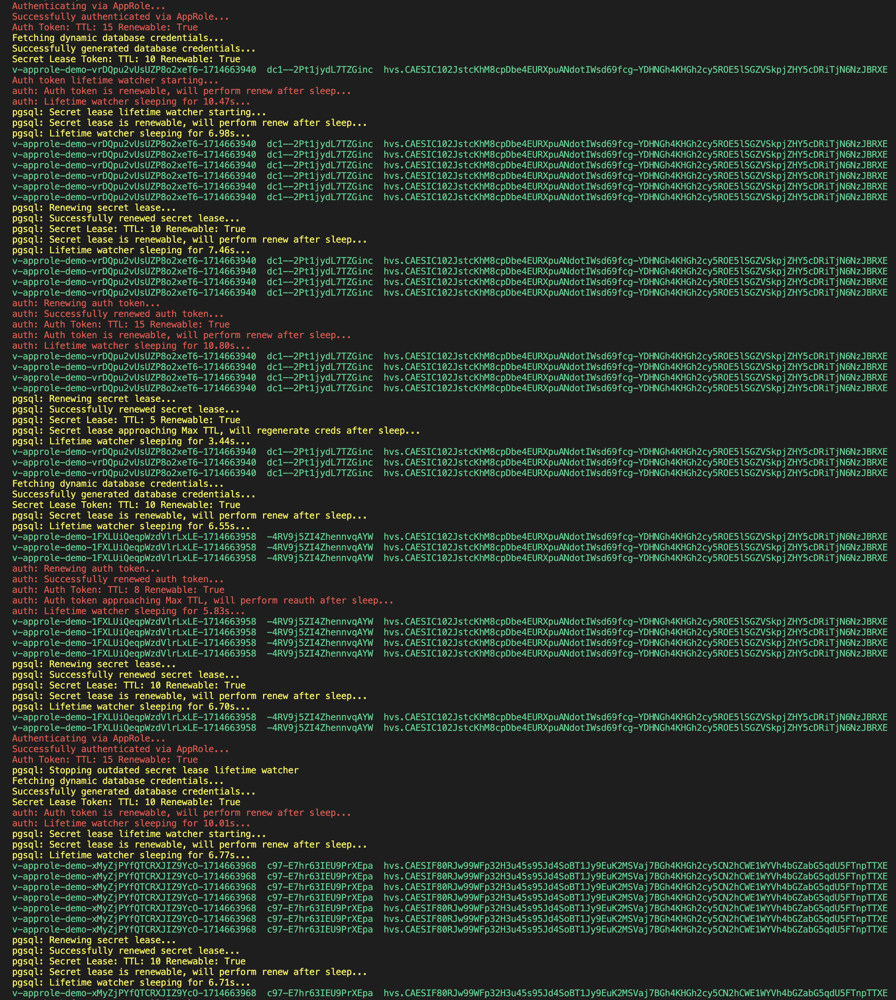

# Python Async - Vault Auth/Secret Lifetime Watcher

Secret leases within HashiCorp Vault are tied to an authentication token. When the token is revoked or reaches its Max TTL, all associated secret leases are revoked.
When building a Vault Auth/Secret Lifetime Watcher it is important to keep this in mind, and regenerate secrets if/when the auth token changes.

### Usage
```shell
$ git clone ...
$ cd ...
$ make dev
```

# Output
In the output below we can see the async tasks renewing token/secret leases when possible, as the token/lease approaches its Max TTL the async tasks reauthenticate or regenerate credentials. Additionally, during reauthentication, new credentials are generated.


